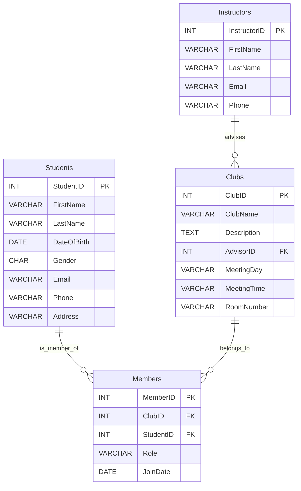

# Schema Diagram




# Table Schema

**Students**

| Field | Description |
| --- | --- |
| StudentID | Unique identifier for each student. |
| FirstName | First name of the student. |
| LastName | Last name of the student. |
| DateOfBirth | Date of birth of the student. |
| Gender | Gender of the student. |
| Email | Email address of the student. |
| Phone | Phone number of the student. |
| Address | Address of the student. |

**Instructors**

| Field | Description |
| --- | --- |
| InstructorID | Unique identifier for each instructor. |
| FirstName | First name of the instructor. |
| LastName | Last name of the instructor. |
| Email | Email address of the instructor. |
| Phone | Phone number of the instructor. |

**Clubs**

| Field | Description |
| --- | --- |
| ClubID | Unique identifier for each club. |
| ClubName | Name of the club. |
| Description | Description of the club. |
| AdvisorID | Identifier linking the club to an instructor (advisor). |
| MeetingDay | Day of the week when the club meets. |
| MeetingTime | Time of the day when the club meets. |
| RoomNumber | Room number where the club meets. |

**Members**

| Field | Description |
| --- | --- |
| MemberID | Unique identifier for each club member. |
| ClubID | Identifier linking the member to a club. |
| StudentID | Identifier linking the member to a student. |
| Role | Role or position of the member in the club. |
| JoinDate | Date when the student joined the club. |


# SQL Schema
```sql
CREATE TABLE Students (
    StudentID INT AUTO_INCREMENT PRIMARY KEY,
    FirstName VARCHAR(50),
    LastName VARCHAR(50),
    DateOfBirth DATE,
    Gender CHAR(1),
    Email VARCHAR(100),
    Phone VARCHAR(15),
    Address VARCHAR(255)
);

CREATE TABLE Instructors (
    InstructorID INT AUTO_INCREMENT PRIMARY KEY,
    FirstName VARCHAR(50),
    LastName VARCHAR(50),
    Email VARCHAR(100),
    Phone VARCHAR(15)
);

CREATE TABLE Clubs (
    ClubID INT AUTO_INCREMENT PRIMARY KEY,
    ClubName VARCHAR(100),
    Description TEXT,
    AdvisorID INT,
    MeetingDay VARCHAR(10),
    MeetingTime VARCHAR(10),
    RoomNumber VARCHAR(10),
    FOREIGN KEY (AdvisorID) REFERENCES Instructors(InstructorID)
);

CREATE TABLE Members (
    MemberID INT AUTO_INCREMENT PRIMARY KEY,
    ClubID INT,
    StudentID INT,
    Role VARCHAR(50),
    JoinDate DATE,
    FOREIGN KEY (ClubID) REFERENCES Clubs(ClubID),
    FOREIGN KEY (StudentID) REFERENCES Students(StudentID)
);
```