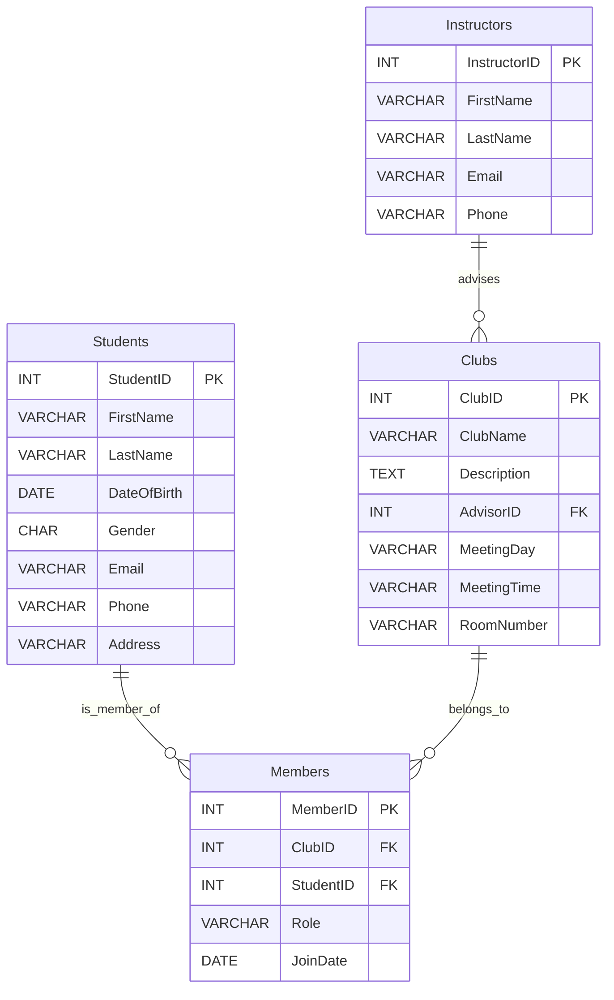

# Schema Diagram



# Types

```typescript
export type Json =
  | string
  | number
  | boolean
  | null
  | { [key: string]: Json | undefined }
  | Json[];

export type Database = {
  public: {
    Tables: {
      clubs: {
        Row: {
          advisorid: number | null;
          clubid: number;
          clubname: string | null;
          description: string | null;
          meetingday: string | null;
          meetingtime: string | null;
          roomnumber: string | null;
        };
        Insert: {
          advisorid?: number | null;
          clubid?: never;
          clubname?: string | null;
          description?: string | null;
          meetingday?: string | null;
          meetingtime?: string | null;
          roomnumber?: string | null;
        };
        Update: {
          advisorid?: number | null;
          clubid?: never;
          clubname?: string | null;
          description?: string | null;
          meetingday?: string | null;
          meetingtime?: string | null;
          roomnumber?: string | null;
        };
        Relationships: [
          {
            foreignKeyName: "clubs_advisorid_fkey";
            columns: ["advisorid"];
            isOneToOne: false;
            referencedRelation: "instructors";
            referencedColumns: ["instructorid"];
          }
        ];
      };
      instructors: {
        Row: {
          email: string | null;
          firstname: string | null;
          instructorid: number;
          lastname: string | null;
          phone: string | null;
        };
        Insert: {
          email?: string | null;
          firstname?: string | null;
          instructorid?: never;
          lastname?: string | null;
          phone?: string | null;
        };
        Update: {
          email?: string | null;
          firstname?: string | null;
          instructorid?: never;
          lastname?: string | null;
          phone?: string | null;
        };
        Relationships: [];
      };
      members: {
        Row: {
          clubid: number | null;
          joindate: string | null;
          memberid: number;
          role: string | null;
          studentid: number | null;
        };
        Insert: {
          clubid?: number | null;
          joindate?: string | null;
          memberid?: never;
          role?: string | null;
          studentid?: number | null;
        };
        Update: {
          clubid?: number | null;
          joindate?: string | null;
          memberid?: never;
          role?: string | null;
          studentid?: number | null;
        };
        Relationships: [
          {
            foreignKeyName: "members_clubid_fkey";
            columns: ["clubid"];
            isOneToOne: false;
            referencedRelation: "clubs";
            referencedColumns: ["clubid"];
          },
          {
            foreignKeyName: "members_studentid_fkey";
            columns: ["studentid"];
            isOneToOne: false;
            referencedRelation: "students";
            referencedColumns: ["studentid"];
          }
        ];
      };
      students: {
        Row: {
          address: string | null;
          dateofbirth: string | null;
          email: string | null;
          firstname: string | null;
          gender: string | null;
          lastname: string | null;
          phone: string | null;
          studentid: number;
        };
        Insert: {
          address?: string | null;
          dateofbirth?: string | null;
          email?: string | null;
          firstname?: string | null;
          gender?: string | null;
          lastname?: string | null;
          phone?: string | null;
          studentid?: never;
        };
        Update: {
          address?: string | null;
          dateofbirth?: string | null;
          email?: string | null;
          firstname?: string | null;
          gender?: string | null;
          lastname?: string | null;
          phone?: string | null;
          studentid?: never;
        };
        Relationships: [];
      };
    };
    Views: {
      [_ in never]: never;
    };
    Functions: {
      [_ in never]: never;
    };
    Enums: {
      [_ in never]: never;
    };
    CompositeTypes: {
      [_ in never]: never;
    };
  };
};

type PublicSchema = Database[Extract<keyof Database, "public">];

export type Tables<
  PublicTableNameOrOptions extends
    | keyof (PublicSchema["Tables"] & PublicSchema["Views"])
    | { schema: keyof Database },
  TableName extends PublicTableNameOrOptions extends { schema: keyof Database }
    ? keyof (Database[PublicTableNameOrOptions["schema"]]["Tables"] &
        Database[PublicTableNameOrOptions["schema"]]["Views"])
    : never = never
> = PublicTableNameOrOptions extends { schema: keyof Database }
  ? (Database[PublicTableNameOrOptions["schema"]]["Tables"] &
      Database[PublicTableNameOrOptions["schema"]]["Views"])[TableName] extends {
      Row: infer R;
    }
    ? R
    : never
  : PublicTableNameOrOptions extends keyof (PublicSchema["Tables"] &
      PublicSchema["Views"])
  ? (PublicSchema["Tables"] &
      PublicSchema["Views"])[PublicTableNameOrOptions] extends {
      Row: infer R;
    }
    ? R
    : never
  : never;

export type TablesInsert<
  PublicTableNameOrOptions extends
    | keyof PublicSchema["Tables"]
    | { schema: keyof Database },
  TableName extends PublicTableNameOrOptions extends { schema: keyof Database }
    ? keyof Database[PublicTableNameOrOptions["schema"]]["Tables"]
    : never = never
> = PublicTableNameOrOptions extends { schema: keyof Database }
  ? Database[PublicTableNameOrOptions["schema"]]["Tables"][TableName] extends {
      Insert: infer I;
    }
    ? I
    : never
  : PublicTableNameOrOptions extends keyof PublicSchema["Tables"]
  ? PublicSchema["Tables"][PublicTableNameOrOptions] extends {
      Insert: infer I;
    }
    ? I
    : never
  : never;

export type TablesUpdate<
  PublicTableNameOrOptions extends
    | keyof PublicSchema["Tables"]
    | { schema: keyof Database },
  TableName extends PublicTableNameOrOptions extends { schema: keyof Database }
    ? keyof Database[PublicTableNameOrOptions["schema"]]["Tables"]
    : never = never
> = PublicTableNameOrOptions extends { schema: keyof Database }
  ? Database[PublicTableNameOrOptions["schema"]]["Tables"][TableName] extends {
      Update: infer U;
    }
    ? U
    : never
  : PublicTableNameOrOptions extends keyof PublicSchema["Tables"]
  ? PublicSchema["Tables"][PublicTableNameOrOptions] extends {
      Update: infer U;
    }
    ? U
    : never
  : never;

export type Enums<
  PublicEnumNameOrOptions extends
    | keyof PublicSchema["Enums"]
    | { schema: keyof Database },
  EnumName extends PublicEnumNameOrOptions extends { schema: keyof Database }
    ? keyof Database[PublicEnumNameOrOptions["schema"]]["Enums"]
    : never = never
> = PublicEnumNameOrOptions extends { schema: keyof Database }
  ? Database[PublicEnumNameOrOptions["schema"]]["Enums"][EnumName]
  : PublicEnumNameOrOptions extends keyof PublicSchema["Enums"]
  ? PublicSchema["Enums"][PublicEnumNameOrOptions]
  : never;
```

# Table Schema

**Students**

| Field       | Description                         |
| ----------- | ----------------------------------- |
| StudentID   | Unique identifier for each student. |
| FirstName   | First name of the student.          |
| LastName    | Last name of the student.           |
| DateOfBirth | Date of birth of the student.       |
| Gender      | Gender of the student.              |
| Email       | Email address of the student.       |
| Phone       | Phone number of the student.        |
| Address     | Address of the student.             |

**Instructors**

| Field        | Description                            |
| ------------ | -------------------------------------- |
| InstructorID | Unique identifier for each instructor. |
| FirstName    | First name of the instructor.          |
| LastName     | Last name of the instructor.           |
| Email        | Email address of the instructor.       |
| Phone        | Phone number of the instructor.        |

**Clubs**

| Field       | Description                                             |
| ----------- | ------------------------------------------------------- |
| ClubID      | Unique identifier for each club.                        |
| ClubName    | Name of the club.                                       |
| Description | Description of the club.                                |
| AdvisorID   | Identifier linking the club to an instructor (advisor). |
| MeetingDay  | Day of the week when the club meets.                    |
| MeetingTime | Time of the day when the club meets.                    |
| RoomNumber  | Room number where the club meets.                       |

**Members**

| Field     | Description                                 |
| --------- | ------------------------------------------- |
| MemberID  | Unique identifier for each club member.     |
| ClubID    | Identifier linking the member to a club.    |
| StudentID | Identifier linking the member to a student. |
| Role      | Role or position of the member in the club. |
| JoinDate  | Date when the student joined the club.      |

# SQL Schema

```sql
CREATE TABLE Students (
    StudentID INT AUTO_INCREMENT PRIMARY KEY,
    FirstName VARCHAR(50),
    LastName VARCHAR(50),
    DateOfBirth DATE,
    Gender CHAR(1),
    Email VARCHAR(100),
    Phone VARCHAR(15),
    Address VARCHAR(255)
);

CREATE TABLE Instructors (
    InstructorID INT AUTO_INCREMENT PRIMARY KEY,
    FirstName VARCHAR(50),
    LastName VARCHAR(50),
    Email VARCHAR(100),
    Phone VARCHAR(15)
);

CREATE TABLE Clubs (
    ClubID INT AUTO_INCREMENT PRIMARY KEY,
    ClubName VARCHAR(100),
    Description TEXT,
    AdvisorID INT,
    MeetingDay VARCHAR(10),
    MeetingTime VARCHAR(10),
    RoomNumber VARCHAR(10),
    FOREIGN KEY (AdvisorID) REFERENCES Instructors(InstructorID)
);

CREATE TABLE Members (
    MemberID INT AUTO_INCREMENT PRIMARY KEY,
    ClubID INT,
    StudentID INT,
    Role VARCHAR(50),
    JoinDate DATE,
    FOREIGN KEY (ClubID) REFERENCES Clubs(ClubID),
    FOREIGN KEY (StudentID) REFERENCES Students(StudentID)
);
```
